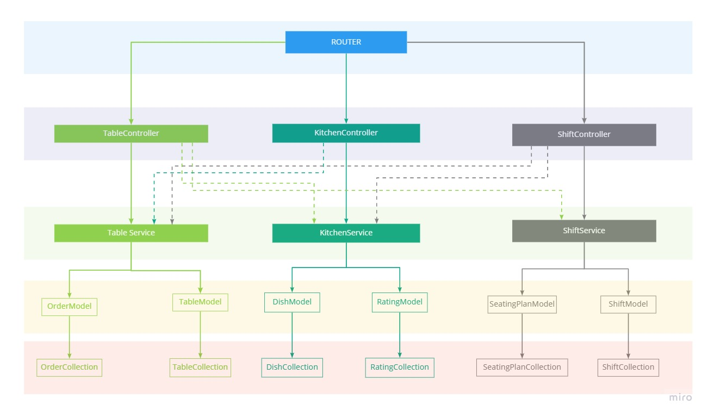

# Alt-Table - Alison Vandromme 

Bordeaux Ynov M1 - Architecture Logicielle (January 2022)

## About Alt-Table

The main goal of the application is to assist a restaurant's staff in service management, while providing customers with a better experience. 

### Functionnalities: 

- Dishes are added with their respective quantity. 
- The menu displays the available dishes.
- Seating plans are created before a shift, and a shift cannot be created if there is no seating plan for this shift.
- Once the shift has started, customers can be installed at a table. 
- Orders can be made, with dish quantity and comments. 
- Dishes can be rated
- The shift state is available with tables' current state, orders and ratings made.

## Application architecture




## Documentation

The documentation is made in OpenAPI 3.0 format.
It is generated from swagger.json file and loaded through [swagger-ui-express](https://github.com/scottie1984/swagger-ui-express).

One the application is running, it can be found on localhost:5000/api/docs.

## Workflow

Each feat/* branch is linked to an US on Jira. Keeping the US in the branch name is important for Jira to update the story. 

## Setup

```sh
npm install
npm run dev
```

## Tests

Tests are ran with jest. To launch the test suite, run: 

``` sh
npm run test
```

## Utilities

- [check-code-coverage](https://github.com/bahmutov/check-code-coverage)

To update code coverage badge, run: 

```sh
npx update-badge
```

